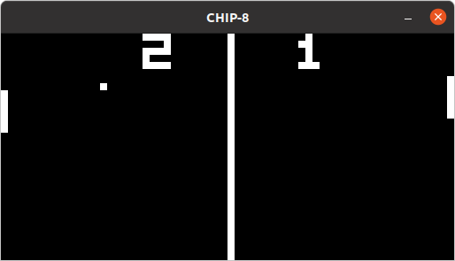
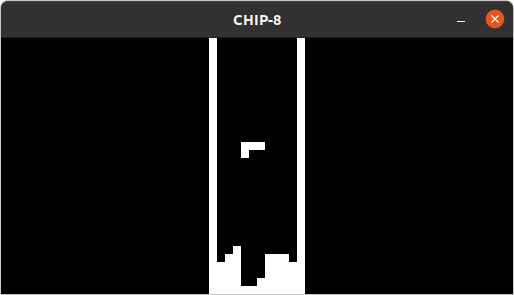
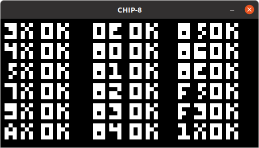

# python-cardiac-emu
[](https://codecov.io/gh/weibell/python-chip8-emu)

[CHIP-8](https://en.wikipedia.org/wiki/CHIP-8) emulation in Python


```commandline
$ python3 main.py "roms/programs/Chip8 emulator Logo [Garstyciuks].ch8""
```


#### Introduction
This interpreter aims to be compatible with the original CHIP-8 instruction set for the COSMAC VIP with no extensions, with the exception of the `0nnn` instruction to execute a machine language subroutine.
In total, 34 opcodes are supported.
It was tested on Python 3.8 using [pygame 2.0.0.dev10](https://pypi.org/project/pygame/2.0.0.dev10/).

#### Usage
```commandline
$ python3 main.py -h
usage: main.py [-h] [--scaling-factor n] [--cycles-per-frame n] [--starting-address n] rom

CHIP-8 interpreter

positional arguments:
  rom                   ROM file

optional arguments:
  -h, --help            show this help message and exit
  --scaling-factor n    Screen scaling factor (default: 8)
  --cycles-per-frame n  CPU cycles per frame (at 60 fps) (default: 10)
  --starting-address n  Starting address (default: 512)

```

#### Screenshots


```commandline
$ python3 main.py "roms/games/Pong (1 player).ch8"
```



```commandline
$ python3 main.py "roms/games/Tetris [Fran Dachille, 1991].ch8""
```



[test_opcode.ch8](https://github.com/corax89/chip8-test-rom) results:



#### Resources
Opcode descriptions for the method names are based on [Cowgod's technical reference](http://devernay.free.fr/hacks/chip8/C8TECH10.HTM).
Since this includes a few errors (for example with the description of opcodes `8XY6`, `8xyE`, `FX55` and `FX65`), [Matthew Mikolay instruction set table](https://github.com/mattmikolay/chip-8/wiki/CHIP%E2%80%908-Instruction-Set) and [chip-8.github.io](https://chip-8.github.io/extensions/#chip-8) were used as the primary sources for the technical implementation.